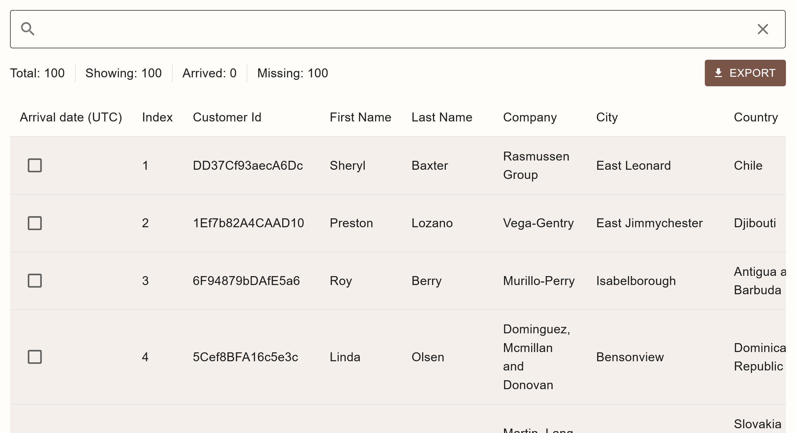

# Project Carnelian

Carnelian is small CSV editor that helps ease the process of event registration for GDG on campus ELTE. It is designed to serve be a simple purpose in mind, to help the organizers quickly search for and check in attendees.

